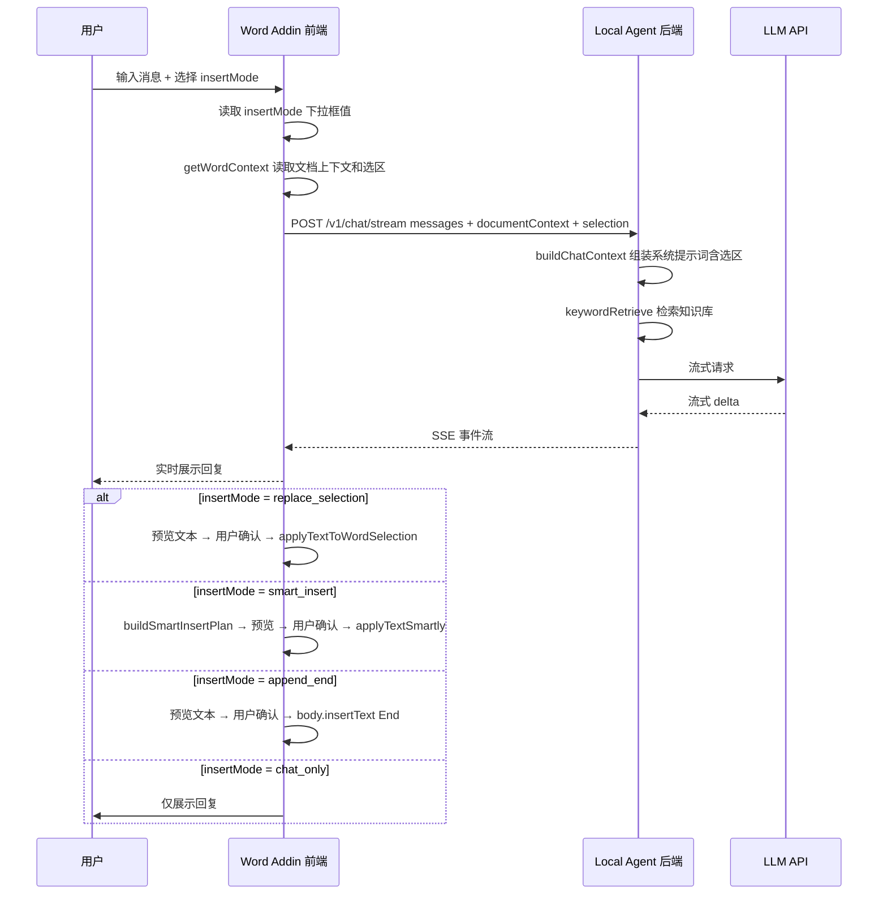

# Word Agent 缺陷诊断与修复计划

## 一、四大已知问题根因分析

### 问题 1：选中的文本没能被 Agent 读取

**根因定位**：[`getWordContext()`](apps/word-addin/src/main.ts:276) 函数逻辑本身正确，但存在以下隐患：

1. **`window.Word` 检测不可靠**（第 277 行）：`!(window as any).Word` 在某些 Office 版本或加载时序下可能返回 `false`，导致直接返回空字符串而静默失败，用户无任何提示。
2. **缺少错误处理**：`Word.run()` 内部如果抛异常，错误会冒泡到 `sendMessage()` 的 catch 块，被报告为"无法连接本地 Agent"，用户无法区分是 Word API 问题还是网络问题。
3. **系统提示词不够明确**：[`buildChatContext()`](apps/local-agent/src/server.ts:163) 虽然把选区文本放进了 system message，但 [`buildPayload()`](apps/local-agent/src/llm.ts:28) 的系统提示词只说"你是一个面向 Word 文档编辑的本地助手"，没有指示模型关注选区内容并据此操作。
4. **项目缺少 `@microsoft/office-js` 类型定义**：`Word.run()` 等调用没有类型保护，编译期无法发现 API 用法错误。

**修复方案**：
- 移除 `window.Word` 手动检测，改用 `Office.onReady()` 返回的 host 信息判断
- 为 `getWordContext()` 添加 try-catch，失败时在 UI 上明确提示"无法读取文档选区"
- 在后端系统提示词中增加对选区的明确指引
- 添加 `@microsoft/office-js` 依赖

---

### 问题 2：智能插入失效

**根因定位**：存在两个独立问题：

1. **`insertMode` 下拉框完全断连**：HTML 中有 [`<select id="insertMode">`](apps/word-addin/index.html:68) 下拉框，但 [`bindActions()`](apps/word-addin/src/main.ts:552) 中没有任何代码读取该下拉框的值。三个发送按钮的行为是硬编码的：
   - `sendMsg` → `{ autoApplyToSelection: false }`
   - `sendAndApply` → `{ autoApplyToSelection: true }`
   - `sendAndAutoPlace` → `{ autoSmartInsert: true }`
   
   用户在下拉框选择的模式被完全忽略。

2. **`buildSmartInsertPlan()` 逻辑缺陷**（第 295-320 行）：当存在选区文本时，**永远返回 `replace_selection`**，无论用户意图是什么。这意味着"智能定位插入"在有选区时退化为"替换选区"，`after_heading` 和 `insert_start` 模式在有选区时永远无法触发。

3. **`after_heading` 模式的 `body.search()` 可能失败**：Word JS API 的 `search()` 方法在某些文档结构下可能返回空结果，且没有回退提示。

**修复方案**：
- 统一发送逻辑：移除三个独立按钮，改为一个"发送"按钮 + `insertMode` 下拉框联动
- 修改 `buildSmartInsertPlan()`：不再在有选区时强制返回 `replace_selection`，而是根据用户选择的模式决定
- 为 `after_heading` 模式增加更友好的回退提示

---

### 问题 3：知识库只能上传，不能管理

**根因定位**：

1. **后端只有上传和统计两个接口**：
   - `POST /v1/kb/upload` — 上传文件
   - `GET /v1/kb/stats` — 获取统计
   
   缺少：删除文件、清空知识库、列出文件详情

2. **[`store.ts`](apps/local-agent/src/store.ts) 只有 `appendChunks` 和 `loadChunks`**：没有按文件名删除分块的函数，也没有清空全部数据的函数。

3. **前端只有上传和刷新状态两个按钮**：没有文件列表、删除、清空操作的 UI。

**修复方案**：
- 后端新增 `DELETE /v1/kb/files/:fileName` 和 `DELETE /v1/kb/clear` 接口
- `store.ts` 新增 `deleteChunksByFile()` 和 `clearAllChunks()` 函数
- 前端新增文件列表展示和删除/清空按钮

---

### 问题 4：会话管理失效

**根因定位**：

1. **HTML 中有会话管理 UI**：[`<select id="sessionSelect">`](apps/word-addin/index.html:57)、`newSession`、`clearSession`、`deleteSession` 按钮都存在。

2. **[`bindActions()`](apps/word-addin/src/main.ts:552) 完全没有绑定这些按钮**：没有给 `newSession`、`clearSession`、`deleteSession`、`sessionSelect` 添加事件监听。

3. **没有会话管理逻辑**：`state` 对象只有 `messages` 和 `lastReply`，没有 sessionId、会话列表等概念。

4. **后端没有会话管理 API**：所有会话状态仅在前端内存中，刷新即丢失。

**修复方案**：
- 前端实现会话管理：sessionId、会话列表、切换、新建、清空、删除
- 使用 `localStorage` 持久化会话数据
- 绑定所有会话相关按钮的事件
- 后端暂不需要会话 API（会话状态纯前端管理即可）

---

## 二、其他发现的缺陷

### 缺陷 5：多个按钮未绑定事件

以下 HTML 元素在 [`bindActions()`](apps/word-addin/src/main.ts:552) 中没有对应的事件监听：

| 元素 ID | 功能 | 状态 |
|---------|------|------|
| `newSession` | 新建会话 | ❌ 未绑定 |
| `clearSession` | 清空当前会话 | ❌ 未绑定 |
| `deleteSession` | 删除当前会话 | ❌ 未绑定 |
| `sessionSelect` | 切换会话 | ❌ 未绑定 |
| `insertMode` | 插入模式选择 | ❌ 未绑定（存在但被忽略） |
| `retryLast` | 重试上一条 | ❌ 未绑定 |
| `insertReplyCursor` | 插入到光标 | ❌ 未绑定 |

### 缺陷 6：缺少预览和撤销机制

计划文档 [`word-sidebar-agent-plan.md`](word-sidebar-agent-plan.md) 明确要求"修改前差异预览"和"一键应用/撤销"，但当前实现直接将文本写入文档，没有任何预览步骤，也没有撤销功能。

### 缺陷 7：`sendMessage` 修改了存入历史的消息

[`sendMessage()`](apps/word-addin/src/main.ts:483) 在 `autoApplyToSelection` 或 `autoSmartInsert` 模式下，会给用户消息追加指令文本并存入 `state.messages`，导致对话历史被污染。

### 缺陷 8：`cleanupMarkdownForWord` 过于激进

[`cleanupMarkdownForWord()`](apps/word-addin/src/main.ts:71) 会移除所有 Markdown 格式，包括用户可能希望保留的列表标记（`- `）和引用标记。

---

## 三、修复计划（按优先级排序）

### P0 — 核心功能修复

| # | 任务 | 涉及文件 |
|---|------|----------|
| 1 | 实现会话管理：sessionId、会话列表、localStorage 持久化、切换/新建/清空/删除 | `main.ts` |
| 2 | 绑定所有未连接的按钮事件：newSession、clearSession、deleteSession、sessionSelect、retryLast、insertReplyCursor | `main.ts` |
| 3 | 统一发送逻辑：合并三个发送按钮为一个 + insertMode 下拉框联动 | `main.ts`, `index.html` |
| 4 | 修复智能插入：insertMode 下拉框驱动插入模式，不再硬编码 | `main.ts` |
| 5 | 修复选区读取：移除不可靠的 window.Word 检测，增加错误处理和 UI 提示 | `main.ts` |
| 6 | 知识库管理：后端新增删除/清空 API，前端新增文件列表和删除/清空 UI | `server.ts`, `store.ts`, `main.ts`, `index.html` |

### P1 — 体验优化

| # | 任务 | 涉及文件 |
|---|------|----------|
| 7 | 后端系统提示词增强：明确指示模型关注选区内容并据此操作 | `llm.ts` |
| 8 | 修复 sendMessage 污染对话历史：追加指令不存入 messages | `main.ts` |
| 9 | 插入前预览：在 chatLog 中展示即将插入的文本，用户确认后再写入 Word | `main.ts`, `index.html` |
| 10 | 添加 `@microsoft/office-js` 类型定义 | `package.json` |

### P2 — 质量提升

| # | 任务 | 涉及文件 |
|---|------|----------|
| 11 | 改进 cleanupMarkdownForWord：保留列表和必要格式 | `main.ts` |
| 12 | 为 Word API 调用增加更友好的错误提示 | `main.ts` |
| 13 | 大文档优化：getWordContext 限制加载范围 | `main.ts` |

---

## 四、核心数据流（修复后）



## 五、会话管理数据结构设计

```typescript
type Session = {
  id: string;
  title: string;
  messages: ChatMessage[];
  createdAt: number;
  updatedAt: number;
};

type AppState = {
  sessions: Session[];
  activeSessionId: string | null;
  lastReply: string;
};
```

- 使用 `localStorage` 存储，key 为 `word-agent-sessions`
- 切换会话时保存当前会话、加载目标会话
- 新建会话时自动切换
- 删除会话时如果删除的是当前会话，自动切换到最近一个

## 六、知识库管理 API 设计

| 方法 | 路径 | 功能 |
|------|------|------|
| GET | `/v1/kb/stats` | 获取统计（已有） |
| POST | `/v1/kb/upload` | 上传文件（已有） |
| GET | `/v1/kb/files` | 列出所有文件及其分块数 |
| DELETE | `/v1/kb/files/:fileName` | 删除指定文件的所有分块 |
| DELETE | `/v1/kb/clear` | 清空整个知识库 |