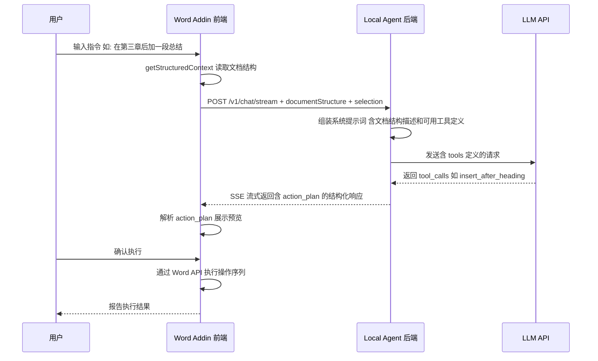
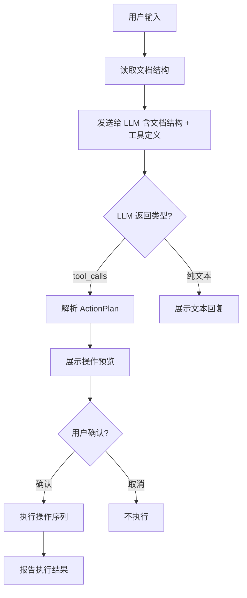

# Word Agent 智能体增强方案

## 一、现状问题诊断

### 1.1 智能定位插入不智能

当前 [`buildSmartInsertPlan()`](apps/word-addin/src/main.ts:661) 使用硬编码正则匹配决定插入位置：

```typescript
// 当前实现：正则匹配关键词
if (/\b(append|at end|conclusion)\b/.test(lower) || /(结尾|末尾)/.test(text)) {
  return { mode: "append_end" };
}
```

**问题**：
- 正则只能识别有限的关键词模式，无法理解自然语言意图
- 有选区时永远退化为 `replace_selection`，`after_heading` 和 `insert_start` 永远无法触发
- `after_heading` 依赖 `body.search()` 精确匹配锚点文本，容易失败
- **LLM 完全没有参与定位决策** — 它只负责生成文本，位置判断全靠正则

### 1.2 Agent 功能太基础

当前 Agent 只能做一件事：**生成文本然后插入**。缺少：
- 文档结构解析（标题层级、段落样式、表格）
- 指定格式插入（标题样式、加粗、列表等）
- 删除内容
- 查找替换
- 多步操作编排

### 1.3 文档上下文太单薄

[`getWordContext()`](apps/word-addin/src/main.ts:628) 只读取 `body.text`（纯文本，截断到 3000 字符），丢失了所有结构信息。LLM 看到的是一坨纯文本，无法知道"这是三级标题"、"这是表格"、"这是加粗段落"。

### 1.4 LLM 只当文本生成器

[`buildPayload()`](apps/local-agent/src/llm.ts:28) 的系统提示词让 LLM "只输出正文内容"，没有给它任何工具调用能力。LLM 无法表达"我要在某个标题后插入一段带格式的文字"这种意图。

---

## 二、增强方案总体架构



### 核心思路：从"文本生成器"升级为"工具调用智能体"

| 维度 | 当前 | 增强后 |
|------|------|--------|
| 定位方式 | 正则匹配关键词 | LLM 通过工具调用指定位置 |
| 文档理解 | 纯文本截断 | 结构化文档树 + 选区 |
| 操作类型 | 仅插入文本 | 插入/替换/删除/格式化/查找替换 |
| 格式支持 | 去除所有 Markdown | 保留标题/加粗/列表等格式 |
| 操作粒度 | 整段文本 | 按段落/标题/选区精确操作 |
| 执行模式 | 直接写入 | 预览 → 确认 → 执行 → 反馈 |

---

## 三、Phase 1 — 增强文档上下文

### 目标
让 LLM 能"看到"文档的结构，而不是一坨纯文本。

### 3.1 新增 `getStructuredContext()` 函数

替换当前的 `getWordContext()`，返回结构化文档信息：

```typescript
type DocumentStructure = {
  // 文档概要信息
  title: string;
  totalParagraphs: number;
  totalCharacters: number;

  // 结构化段落列表 — 只取前 N 段避免过长
  paragraphs: Array<{
    index: number;          // 段落序号
    text: string;            // 段落文本 截断到 200 字
    style: string;           // 样式名 如 Heading1/Normal/ListParagraph
    headingLevel?: number;  // 标题级别 1-9
    isTable: boolean;        // 是否是表格
    isList: boolean;         // 是否是列表项
  }>;

  // 当前选区信息
  selection: {
    text: string;
    startParagraphIndex?: number;
    endParagraphIndex?: number;
  };
};
```

### 3.2 Word API 实现

```typescript
async function getStructuredContext(): Promise<DocumentStructure> {
  return Word.run(async (context) => {
    const body = context.document.body;
    const selection = context.document.getSelection();

    // 读取段落集合
    const paragraphs = body.paragraphs;
    paragraphs.load(["items"]);
    await context.sync();

    const paraList: DocumentStructure["paragraphs"] = [];
    const MAX_PARAGRAPHS = 80;
    const MAX_TEXT_LENGTH = 200;

    for (let i = 0; i < Math.min(paragraphs.items.length, MAX_PARAGRAPHS); i++) {
      const p = paragraphs.items[i];
      p.load(["text", "style", "isListItem"]);
      await context.sync();

      const text = (p.text || "").trim();
      if (!text) continue;

      const style = (p.style || "Normal").toString();
      const headingMatch = style.match(/Heading(\d)/i);
      paraList.push({
        index: i,
        text: text.slice(0, MAX_TEXT_LENGTH),
        style,
        headingLevel: headingMatch ? parseInt(headingMatch[1]) : undefined,
        isTable: false, // Word JS API 不直接支持段落级表格检测
        isList: p.isListItem,
      });
    }

    // 读取选区
    selection.load("text");
    await context.sync();

    return {
      title: "",
      totalParagraphs: paragraphs.items.length,
      totalCharacters: 0,
      paragraphs: paraList,
      selection: {
        text: (selection.text || "").slice(0, 2000),
      },
    };
  });
}
```

### 3.3 将结构化上下文传给后端

修改 `sendMessageStream` 的 payload，新增 `documentStructure` 字段：

```typescript
type ChatPayload = {
  messages: ChatMessage[];
  documentContext: string;        // 保留纯文本作为兼容
  documentStructure?: DocumentStructure;  // 新增结构化信息
  selection: string;
};
```

### 3.4 后端 `buildChatContext` 适配

在 [`server.ts`](apps/local-agent/src/server.ts:222) 的 `buildChatContext` 中，将 `documentStructure` 转为自然语言描述注入系统提示词：

```typescript
function describeDocumentStructure(structure: DocumentStructure): string {
  const lines: string[] = [];
  lines.push(`文档共 ${structure.totalParagraphs} 段。结构概览：`);

  for (const p of structure.paragraphs) {
    if (p.headingLevel) {
      lines.push(`  ${"#".repeat(p.headingLevel)} [段落${p.index}] ${p.text}`);
    } else if (p.isList) {
      lines.push(`  - [段落${p.index}] ${p.text}`);
    } else {
      lines.push(`  [段落${p.index}] ${p.text.slice(0, 100)}`);
    }
  }

  if (structure.selection.text) {
    lines.push(`\n当前选区（段落${structure.selection.startParagraphIndex ?? "?"}附近）：${structure.selection.text.slice(0, 500)}`);
  }

  return lines.join("\n");
}
```

---

## 四、Phase 2 — 定义 Word 操作工具集

### 目标
让 LLM 能通过 Function Calling 表达操作意图，而不是只输出纯文本。

### 4.1 工具定义

```typescript
type WordAction = {
  action: string;
  params: Record<string, any>;
  description: string;  // 人类可读描述，用于预览
};

// 工具定义 — 传给 LLM 的 function calling schema
const WORD_TOOLS = [
  {
    name: "insert_after_heading",
    description: "在指定标题后插入新内容。通过 heading_text 定位标题，支持指定格式。",
    parameters: {
      type: "object",
      properties: {
        heading_text: { type: "string", description: "要查找的标题文本" },
        content: { type: "string", description: "要插入的内容" },
        format: {
          type: "string",
          enum: ["normal", "heading1", "heading2", "heading3", "bullet_list", "numbered_list"],
          description: "插入内容的格式"
        }
      },
      required: ["heading_text", "content"]
    }
  },
  {
    name: "replace_selection",
    description: "替换当前选中的文本内容。",
    parameters: {
      type: "object",
      properties: {
        content: { type: "string", description: "替换后的新内容" },
        format: {
          type: "string",
          enum: ["normal", "heading1", "heading2", "heading3", "bullet_list", "numbered_list"],
          description: "替换内容的格式"
        }
      },
      required: ["content"]
    }
  },
  {
    name: "insert_at_end",
    description: "在文档末尾追加内容。",
    parameters: {
      type: "object",
      properties: {
        content: { type: "string", description: "要追加的内容" },
        format: {
          type: "string",
          enum: ["normal", "heading1", "heading2", "heading3", "bullet_list", "numbered_list"],
          description: "追加内容的格式"
        }
      },
      required: ["content"]
    }
  },
  {
    name: "insert_at_start",
    description: "在文档开头插入内容。",
    parameters: {
      type: "object",
      properties: {
        content: { type: "string", description: "要插入的内容" },
        format: {
          type: "string",
          enum: ["normal", "heading1", "heading2", "heading3", "bullet_list", "numbered_list"],
          description: "插入内容的格式"
        }
      },
      required: ["content"]
    }
  },
  {
    name: "insert_after_paragraph",
    description: "在指定段落序号后插入内容。段落序号从文档结构中获取。",
    parameters: {
      type: "object",
      properties: {
        paragraph_index: { type: "number", description: "目标段落的序号" },
        content: { type: "string", description: "要插入的内容" },
        format: {
          type: "string",
          enum: ["normal", "heading1", "heading2", "heading3", "bullet_list", "numbered_list"],
          description: "插入内容的格式"
        }
      },
      required: ["paragraph_index", "content"]
    }
  },
  {
    name: "delete_paragraph",
    description: "删除指定段落序号的内容。",
    parameters: {
      type: "object",
      properties: {
        paragraph_index: { type: "number", description: "要删除的段落序号" }
      },
      required: ["paragraph_index"]
    }
  },
  {
    name: "find_and_replace",
    description: "在文档中查找文本并替换为新文本。",
    parameters: {
      type: "object",
      properties: {
        find_text: { type: "string", description: "要查找的文本" },
        replace_text: { type: "string", description: "替换后的文本" }
      },
      required: ["find_text", "replace_text"]
    }
  },
  {
    name: "reply_only",
    description: "仅回复文本，不执行任何文档操作。用于纯问答、解释、建议等场景。",
    parameters: {
      type: "object",
      properties: {
        content: { type: "string", description: "回复给用户的文本内容" }
      },
      required: ["content"]
    }
  }
];
```

### 4.2 Action Plan 结构

LLM 返回的可能是单个工具调用，也可能是多个工具调用的序列：

```typescript
type ActionPlan = {
  actions: WordAction[];
  explanation: string;  // LLM 对操作意图的自然语言解释
};
```

---

## 五、Phase 3 — 后端支持 Function Calling

### 目标
让后端能向 LLM 传递工具定义，并解析 LLM 返回的工具调用。

### 5.1 修改 `buildPayload()`

在 [`llm.ts`](apps/local-agent/src/llm.ts:28) 的 `buildPayload` 中，增加 `tools` 参数：

```typescript
function buildPayload(
  config: ProviderConfig,
  messages: ChatMessage[],
  contextChunks: RetrievalChunk[],
  stream: boolean,
  tools?: Array<{ type: string; function: any }>  // 新增
) {
  // ... 现有逻辑 ...

  const payload: Record<string, any> = {
    model: config.model,
    messages: [systemPrompt, retrievalPrompt, ...messages],
    temperature: config.temperature ?? 0.2,
    max_tokens: config.maxTokens ?? 900,
    stream,
  };

  if (tools && tools.length > 0) {
    payload.tools = tools;
    payload.tool_choice = "auto";
  }

  return payload;
}
```

### 5.2 修改系统提示词

更新系统提示词，让 LLM 知道它可以调用工具：

```typescript
const systemPrompt: ChatMessage = {
  role: "system",
  content: `你是一个面向 Word 文档编辑的智能助手。你可以通过调用工具来操作文档。

关键规则：
1. 你可以调用以下工具来操作文档：insert_after_heading, replace_selection, insert_at_end, insert_at_start, insert_after_paragraph, delete_paragraph, find_and_replace, reply_only
2. 根据文档结构和用户意图选择最合适的工具和参数
3. 如果用户要求在某个位置插入内容，优先使用 insert_after_heading 或 insert_after_paragraph，而不是让用户手动定位
4. 如果用户要求删除内容，使用 delete_paragraph 或 find_and_replace
5. 如果用户只是提问或需要建议，使用 reply_only
6. 当使用 insert/replace 工具时，content 参数应该是可直接写入 Word 的纯文本，不要使用 Markdown 标记
7. format 参数用于指定插入内容的格式，默认为 normal

${documentStructureDescription}`
};
```

### 5.3 解析 LLM 返回的工具调用

修改流式响应处理逻辑，支持解析 `tool_calls`：

```typescript
type StreamResponse = {
  type: "delta" | "done" | "error" | "action_plan";
  delta?: string;
  reply?: string;
  actionPlan?: ActionPlan;
  // ... 现有字段
};
```

当 LLM 返回 `tool_calls` 时，后端将其转换为 `ActionPlan` 传给前端。

### 5.4 兼容非 Function Calling 模型

不是所有 OpenAI 兼容模型都支持 function calling。需要兼容策略：

```typescript
// 如果模型不支持 function calling，回退到提示词模式
const FALLBACK_SYSTEM_PROMPT = `
当你需要操作文档时，请用以下 JSON 格式输出操作计划，用 <action_plan> 标签包裹：

<action_plan>
{
  "actions": [
    {"action": "insert_after_heading", "params": {"heading_text": "第三章", "content": "...", "format": "normal"}}
  ],
  "explanation": "在第三章标题后插入总结段落"
}
</action_plan>

如果你只是回复文本而不需要操作文档，直接输出文本即可，不要使用 <action_plan> 标签。
`;
```

---

## 六、Phase 4 — 前端 Action 执行层

### 目标
前端能解析 LLM 返回的操作计划，展示预览，并在用户确认后通过 Word API 执行。

### 6.1 Action 执行器

```typescript
async function executeAction(action: WordAction): Promise<string> {
  return Word.run(async (context) => {
    switch (action.action) {
      case "insert_after_heading": {
        const { heading_text, content, format = "normal" } = action.params;
        const body = context.document.body;
        const matches = body.search(heading_text, { matchCase: false });
        matches.load("items");
        await context.sync();

        if (matches.items.length > 0) {
          const range = matches.items[0];
          const paragraph = range.paragraphs.getFirst();
          paragraph.insertParagraph(content, "After");
          // 应用格式
          await applyFormat(paragraph, format, context);
          await context.sync();
          return `已在"${heading_text}"后插入内容`;
        }
        // 找不到标题，回退到末尾
        body.paragraphs.getLast().insertParagraph(content, "After");
        await context.sync();
        return `未找到标题"${heading_text}"，已插入到文档末尾`;
      }

      case "replace_selection": {
        const { content, format = "normal" } = action.params;
        const selection = context.document.getSelection();
        selection.insertText(content, "Replace");
        await context.sync();
        return "已替换选区内容";
      }

      case "insert_at_end": {
        const { content, format = "normal" } = action.params;
        const body = context.document.body;
        body.insertParagraph(content, "End");
        await context.sync();
        return "已追加到文档末尾";
      }

      case "insert_at_start": {
        const { content, format = "normal" } = action.params;
        const body = context.document.body;
        body.insertParagraph(content, "Start");
        await context.sync();
        return "已插入到文档开头";
      }

      case "insert_after_paragraph": {
        const { paragraph_index, content, format = "normal" } = action.params;
        const body = context.document.body;
        const paragraphs = body.paragraphs;
        paragraphs.load("items");
        await context.sync();

        if (paragraph_index >= 0 && paragraph_index < paragraphs.items.length) {
          paragraphs.items[paragraph_index].insertParagraph(content, "After");
          await context.sync();
          return `已在段落 ${paragraph_index} 后插入内容`;
        }
        body.insertParagraph(content, "End");
        await context.sync();
        return `段落序号 ${paragraph_index} 超出范围，已插入到末尾`;
      }

      case "delete_paragraph": {
        const { paragraph_index } = action.params;
        const body = context.document.body;
        const paragraphs = body.paragraphs;
        paragraphs.load("items");
        await context.sync();

        if (paragraph_index >= 0 && paragraph_index < paragraphs.items.length) {
          paragraphs.items[paragraph_index].delete();
          await context.sync();
          return `已删除段落 ${paragraph_index}`;
        }
        return `段落序号 ${paragraph_index} 超出范围，未执行删除`;
      }

      case "find_and_replace": {
        const { find_text, replace_text } = action.params;
        const body = context.document.body;
        const ranges = body.search(find_text, { matchCase: true });
        ranges.load("items");
        await context.sync();

        if (ranges.items.length > 0) {
          ranges.items[0].insertText(replace_text, "Replace");
          await context.sync();
          return `已替换 ${ranges.items.length} 处匹配中的第 1 处`;
        }
        return `未找到"${find_text}"`;
      }

      default:
        return `未知操作: ${action.action}`;
    }
  });
}
```

### 6.2 格式应用函数

```typescript
async function applyFormat(
  paragraph: Word.Paragraph,
  format: string,
  context: Word.RequestContext
): Promise<void> {
  switch (format) {
    case "heading1":
      paragraph.style = "Heading 1";
      break;
    case "heading2":
      paragraph.style = "Heading 2";
      break;
    case "heading3":
      paragraph.style = "Heading 3";
      break;
    case "bullet_list":
      paragraph.style = "List Paragraph";
      // Word JS API 中设置项目符号需要通过 ListFormat
      break;
    case "numbered_list":
      paragraph.style = "List Paragraph";
      break;
    default:
      // "normal" — 不需要额外设置
      break;
  }
  await context.sync();
}
```

### 6.3 预览与确认 UI

当 LLM 返回 `action_plan` 时，前端展示操作预览：

```
┌─────────────────────────────────────┐
│ 📋 操作预览                          │
│                                     │
│ LLM 解释：在第三章标题后插入总结段落    │
│                                     │
│ 操作 1: insert_after_heading         │
│   目标标题: "第三章 项目实施"          │
│   插入内容: "本章总结了项目实施..."     │
│   格式: normal                       │
│                                     │
│  [✅ 确认执行]  [❌ 取消]  [✏️ 编辑]   │
└─────────────────────────────────────┘
```

---

## 七、Phase 5 — 替换智能插入为 LLM 驱动

### 目标
移除 `buildSmartInsertPlan()` 的正则匹配逻辑，让 LLM 通过工具调用决定操作方式。

### 7.1 修改 `sendMessage()` 流程

```typescript
async function sendMessage(): Promise<void> {
  // ... 现有逻辑 ...

  const wordContext = await getStructuredContext();  // 替换 getWordContext

  const data = await sendMessageStream({
    messages: [{ role: "user", content: llmPrompt }],
    documentContext: wordContext.selection?.text || "",
    documentStructure: wordContext,  // 新增
    selection: wordContext.selection?.text || "",
  });

  // 判断返回类型
  if (data.actionPlan) {
    // LLM 返回了操作计划 — 展示预览
    showActionPlanPreview(data.actionPlan);
  } else {
    // LLM 返回了纯文本 — 按现有逻辑处理
    state.lastReply = data.reply;
    // ... 现有插入逻辑 ...
  }
}
```

### 7.2 移除 `buildSmartInsertPlan()`

完全移除 [`buildSmartInsertPlan()`](apps/word-addin/src/main.ts:661) 函数和 `SmartInsertPlan` 类型。`insertMode` 下拉框简化为：

| 选项 | 行为 |
|------|------|
| 仅对话 | LLM 使用 `reply_only`，不执行任何文档操作 |
| 智能操作 | LLM 自行选择最合适的工具调用 |
| 替换选区 | 强制 LLM 使用 `replace_selection` |
| 追加到文末 | 强制 LLM 使用 `insert_at_end` |

### 7.3 后端 chatSchema 适配

```typescript
const chatSchema = z.object({
  messages: z.array(z.object({
    role: z.enum(["system", "user", "assistant"]),
    content: z.string().min(1)
  })),
  documentContext: z.string().optional(),
  documentStructure: z.object({
    title: z.string(),
    totalParagraphs: z.number(),
    totalCharacters: z.number(),
    paragraphs: z.array(z.object({
      index: z.number(),
      text: z.string(),
      style: z.string(),
      headingLevel: z.number().optional(),
      isTable: z.boolean(),
      isList: z.boolean(),
    })),
    selection: z.object({
      text: z.string(),
      startParagraphIndex: z.number().optional(),
      endParagraphIndex: z.number().optional(),
    }),
  }).optional(),
  selection: z.string().optional(),
  insertMode: z.enum(["chat_only", "smart_action", "replace_selection", "append_end"]).optional(),
});
```

---

## 八、Phase 6 — 多步操作与错误恢复

### 8.1 多步操作

LLM 可能一次返回多个工具调用（例如：先删除旧内容，再插入新内容）。前端需要：

1. 按顺序展示所有操作
2. 用户可以逐个确认或批量确认
3. 依次执行每个操作
4. 每个操作执行后报告结果

```typescript
async function executeActionPlan(plan: ActionPlan): Promise<void> {
  const results: string[] = [];

  for (const action of plan.actions) {
    try {
      const result = await executeAction(action);
      results.push(`✅ ${action.description}: ${result}`);
    } catch (error) {
      results.push(`❌ ${action.description}: ${error instanceof Error ? error.message : "执行失败"}`);
      // 询问用户是否继续
      const shouldContinue = confirm(`操作失败: ${error}\n\n是否继续执行后续操作？`);
      if (!shouldContinue) break;
    }
  }

  setStatus(chatStatus, results.join("\n"));
}
```

### 8.2 操作回滚

Word JS API 支持 `context.sync()` 的原子性。对于多步操作：

- 每个操作在独立的 `Word.run()` 中执行
- 失败时不会影响已执行的操作
- 用户可以通过 Word 内置的 Ctrl+Z 撤销

### 8.3 错误恢复策略

| 错误类型 | 处理方式 |
|---------|---------|
| 标题未找到 | 回退到文档末尾插入，并告知用户 |
| 段落序号越界 | 回退到文档末尾插入 |
| 选区为空 | 提示用户先选中文本 |
| Word API 异常 | 展示错误信息，不执行操作 |
| LLM 返回格式错误 | 尝试解析纯文本回复作为 fallback |

---

## 九、数据流对比

### 当前数据流


### 增强后数据流



---

## 十、实施步骤与文件变更清单

### Phase 1: 增强文档上下文

| 文件 | 变更 |
|------|------|
| `apps/word-addin/src/main.ts` | 新增 `getStructuredContext()` 替换 `getWordContext()`；新增 `DocumentStructure` 类型 |
| `apps/local-agent/src/types.ts` | 新增 `DocumentStructure` 类型定义 |
| `apps/local-agent/src/server.ts` | `chatSchema` 增加 `documentStructure` 字段；`buildChatContext` 增加结构化上下文描述 |
| `apps/local-agent/src/llm.ts` | 系统提示词增加文档结构描述 |

### Phase 2: 定义 Word 操作工具集

| 文件 | 变更 |
|------|------|
| `apps/word-addin/src/main.ts` | 新增 `WordAction` 类型定义、`WORD_TOOLS` 常量 |
| `apps/local-agent/src/types.ts` | 新增 `WordAction`、`ActionPlan` 类型 |
| `apps/local-agent/src/llm.ts` | `buildPayload` 增加 `tools` 参数 |

### Phase 3: 后端支持 Function Calling

| 文件 | 变更 |
|------|------|
| `apps/local-agent/src/llm.ts` | `buildPayload` 支持 tools 参数；`streamOpenAICompatible` 和 `callOpenAICompatible` 解析 `tool_calls` |
| `apps/local-agent/src/server.ts` | `/v1/chat/stream` 和 `/v1/chat` 传递 tools；解析 LLM 返回的 tool_calls 并转为 ActionPlan |
| `apps/local-agent/src/types.ts` | 新增 `ActionPlan` 相关类型 |

### Phase 4: 前端 Action 执行层

| 文件 | 变更 |
|------|------|
| `apps/word-addin/src/main.ts` | 新增 `executeAction()`、`applyFormat()`、`executeActionPlan()` 函数；修改预览 UI 逻辑 |
| `apps/word-addin/index.html` | 新增操作预览面板 HTML |
| `apps/word-addin/src/styles.css` | 新增预览面板样式 |

### Phase 5: 替换智能插入为 LLM 驱动

| 文件 | 变更 |
|------|------|
| `apps/word-addin/src/main.ts` | 移除 `buildSmartInsertPlan()`、`SmartInsertPlan` 类型；修改 `sendMessage()` 流程；简化 `insertMode` 下拉框 |
| `apps/word-addin/index.html` | 更新 `insertMode` 选项 |
| `apps/local-agent/src/server.ts` | `buildChatContext` 根据 `insertMode` 调整系统提示词 |

### Phase 6: 多步操作与错误恢复

| 文件 | 变更 |
|------|------|
| `apps/word-addin/src/main.ts` | `executeActionPlan()` 支持多步执行和错误恢复；操作结果展示 |

---

## 十一、兼容性考虑

### 11.1 非 Function Calling 模型兼容

对于不支持 `tools` 参数的模型（如某些开源模型），采用提示词回退方案：

- 检测模型是否支持 function calling（通过 `/models` 接口或配置项）
- 不支持时，在系统提示词中增加 `<action_plan>` 格式说明
- 前端解析 `<action_plan>` 标签作为 fallback

### 11.2 Word API 版本兼容

- `paragraphs` 集合、`search()` 方法在 Word JS API 1.1+ 可用
- `style` 属性设置需要 Word JS API 1.3+
- 需要在 `manifest.xml` 中确认 `Requirements` 版本

### 11.3 大文档性能

- `getStructuredContext()` 限制最多读取 80 个段落
- 每个段落文本截断到 200 字符
- 选区文本截断到 2000 字符
- 总上下文控制在合理范围内避免 token 超限

---

## 十二、风险与缓解

| 风险 | 缓解措施 |
|------|---------|
| LLM 返回格式不稳定 | 严格的 JSON Schema 验证 + fallback 到纯文本模式 |
| Word API 调用失败 | 每个操作独立 try-catch，不中断后续操作 |
| Function Calling 不被模型支持 | 提示词回退方案 + 配置开关 |
| 大文档上下文过长 | 段落数量和文本长度双重限制 |
| 多步操作部分失败 | 逐个执行 + 用户确认继续 + Word Ctrl+Z 兜底 |