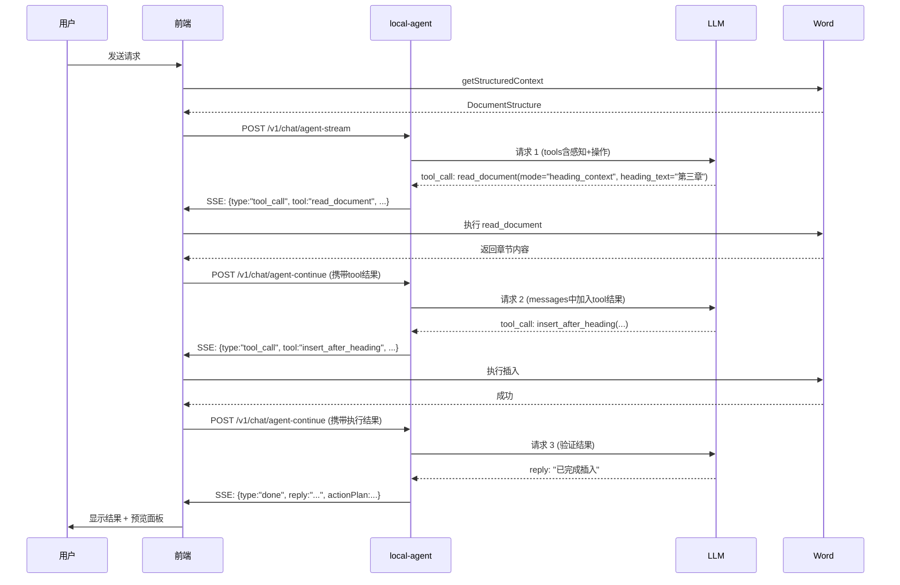
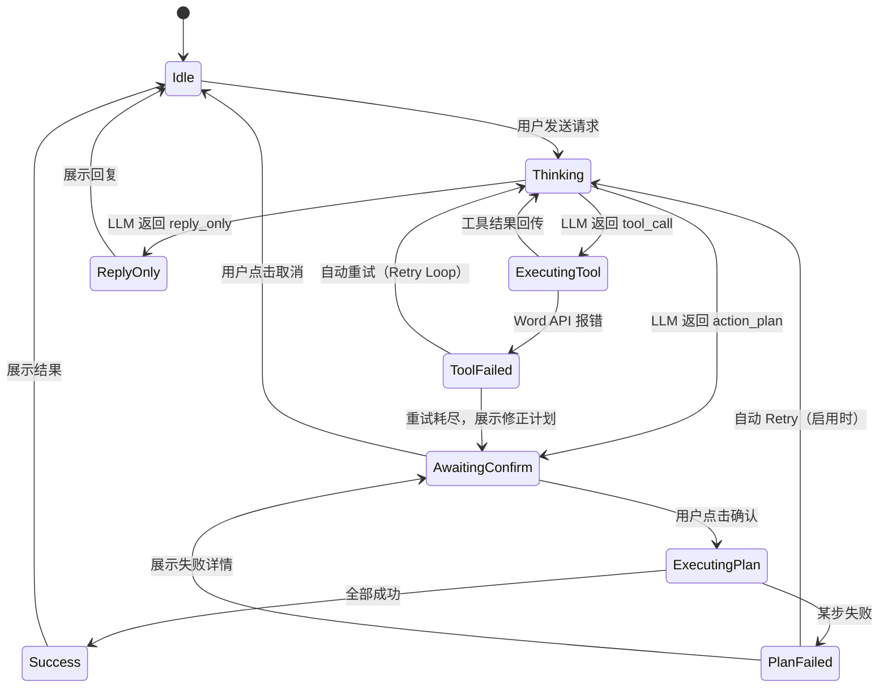

# Word Agent 工具与工作流分析

> 本文档基于当前代码（`apps/local-agent/src/llm.ts`、`apps/word-addin/src/main.ts`）整理，供 LLM 和开发者参考。

---

## 一、当前提供给 LLM 的工具（OpenAI Function Calling）

| # | 工具名 | 说明 | 参数 | 常见问题 |
|---|---|--------|------|------|----------|
| 1 | `insert_after_heading` | 在指定标题后插入内容 | `heading_text`(string), `content`(string), `format`(enum) | 标题匹配失败时 fallback 到文档末尾，但用户无感知 |
| 2 | `replace_selection` | 替换当前选区 | `content`(string), `format`(enum) | 若选区为空则变成在光标处插入，行为可能不符合预期 |
| 3 | `insert_at_end` | 在文档末尾追加 | `content`(string), `format`(enum) | 相对安全，但若文档为空，`getLast()` 可能抛错 |
| 4 | `insert_at_start` | **在文档开头插入** | `content`(string), `format`(enum) | **高危**：空文档时 `getFirst()` 报 `InvalidArgument`；空 content 也会报错 |
| 5 | `insert_after_paragraph` | 在指定段落序号后插入 | `paragraph_index`(number), `content`(string), `format`(enum) | 段落序号由前端结构提供，LLM 可能误用索引 |
| 6 | `delete_paragraph` | 删除指定段落 | `paragraph_index`(number) | 同上，索引误用风险 |
| 7 | `find_and_replace` | 查找并替换 | `find_text`(string), `replace_text`(string) | 仅替换第一处匹配；`matchCase: true` 导致大小写敏感，可能找不到 |
| 8 | `reply_only` | 仅回复文本，不操作文档 | `content`(string) | 无风险 |

### format 枚举值
```
"normal" | "heading1" | "heading2" | "heading3" | "bullet_list" | "numbered_list"
```

### 工具设计的结构性缺陷

1. **没有 `"insert_at_cursor"` 工具**
   用户直觉是在当前光标位置插入，但现有工具只能 `"replace_selection"` 或 `"insert_at_end"`。若选区为空，`replace_selection` 行为等同于在光标处插入，但 LLM 无法判断当前是否有选区。

2. **没有 `"get_document_state"` 或 `"read_range"` 工具**
   LLM 仅能看到前端传来的静态 `documentStructure`（最多 80 段，每段截断 200 字），无法在执行工具链中间读取最新文档状态。这导致多步操作（如"在 A 后面插入，再在 B 后面插入"）可能基于过时的段落索引失败。

3. **`insert_after_paragraph` 依赖前端截断后的索引**
   前端只传前 80 段，如果文档超过 80 段，LLM 调用 `insert_after_paragraph` 时引用的索引可能指向错误位置或 fallback 到末尾。

4. **`find_and_replace` 能力太弱**
   - 只替换第一处
   - `matchCase: true`（严格大小写）
   - 不支持正则
   - 没有返回"替换了几处"的信息给 LLM

5. **缺少 undo / 原子性保证**
   每个工具独立执行，如果 ActionPlan 第 2 步失败，第 1 步不会回滚。用户看到的是半成品文档。

---

## 二、Word 编辑工作流分析

### 2.1 当前数据流

```
[用户输入] → [前端 main.ts]
                │
                ├─ 读取文档结构 (getStructuredContext) ──→ Word JS API
                │
                ├─ 发送 POST /v1/chat/stream ──→ [local-agent server.ts]
                │                                      │
                │                                      ├─ 构建 system prompt
                │                                      ├─ 检索知识库 (keywordRetrieve)
                │                                      └─ 调用 LLM (streamOpenAICompatible)
                │                                         (tools=WORD_TOOLS, tool_choice=auto)
                │
                └─ 接收 SSE stream ──→ 解析出 actionPlan
                                           │
                                           ▼
                                    [ActionPlan 预览面板]
                                           │
                                    [用户点击"确认"]
                                           │
                                           ▼
                                    [前端 executeActionPlan]
                                           │
                                    逐个调用 executeAction
                                           │
                                    Word.run(...) → Word JS API
```

### 2.2 关键问题点

#### A. LLM 的决策信息不足

当前 `system prompt` 包含：
- 文档上下文（截断到 3000 字）
- 文档结构（最多 80 段，每段截断 200 字）
- 当前选区文本
- 知识库检索片段

**缺失信息**：
- 光标位置（`selection.startParagraphIndex` 字段有定义但前端没有真正填入）
- 文档总字数精确值（虽然有 `totalCharacters`）
- 各段落的实际字符数（前端截断了）
- 用户上一次操作的结果（LLM 不知道上一步是否成功）

#### B. 工具调用 vs. 简单插入的割裂

前端有两种完全不同的插入路径：

| 路径 | 触发条件 | 执行方式 |
|------|----------|----------|
| **ActionPlan 路径** | `insertMode === "smart_action"` 且 LLM 返回 `tool_calls` | 先预览，再逐个 `executeAction` |
| **简单插入路径** | `insertMode === "replace_selection" / "append_end"` 或无 actionPlan | `showSimplePreview` → `confirmSimplePreview` |

**问题**：
- 即使用户选择了 `"smart_action"`，如果 LLM 没有返回 tool_calls，回退到简单路径时不会自动执行，而是仅显示文本。
- `"insert_start"` 简单路径被映射到了 `insertLastReplyAtCursor`（函数名和实际行为不符，实际是 `"insert_start"`）。

#### C. 错误处理过于粗糙

- `executeAction` 里的 `try/catch` 只捕获到 `Error.message`，Office.js 的错误对象包含 `code`、`traceMessages`、`debugInfo` 等大量有用信息，之前被完全丢弃。
- 用户看到的只有：`❌ 插入内容到文档开头: InvalidArgument`，无法判断是空文档、空内容、还是 Word API 其他限制。

#### D. Markdown 清洗的双刃剑

`cleanupMarkdownForWord` 会去除：
- 代码块标记
- 标题符号 `#`
- 加粗/斜体 `**`、`*`、`_`
- 列表符号
- 引用块 `>`
- 链接 `[text](url)` → `text (url)`

**问题**：
- 如果 LLM 返回的内容被清洗后变成空字符串，Word API 会报 `InvalidArgument`。
- 链接转换可能产生不自然的文本。
- 没有保留列表结构（只是简单替换为 `- `）。

---

## 三、工作流改进建议

### 3.1 短期（增强鲁棒性）

1. **空文档保护**：所有使用 `getFirst()` / `getLast()` 的地方都加 fallback 到 `body.insertParagraph(..., "Start")`。
2. **空内容保护**：`executeAction` 入口处统一校验 `content` 非空。
3. **错误信息丰富化**：保留 Office.js 错误的完整字段（已部分实现）。
4. **修复 `insert_after_paragraph` 越界行为**：当前越界时静默 fallback 到末尾，应该明确报错或询问用户。

### 3.2 中期（工具重构）

1. **新增 `insert_at_cursor` 工具**
   明确替代 `"replace_selection"` 在空选区时的模糊语义。

2. **新增 `read_document` 工具**
   让 LLM 能在工具链中间读取指定段落或范围，而不是依赖一次性的静态结构。

3. **改造 `find_and_replace`**
   - 支持 `replace_all` 参数
   - 支持 `matchCase` 参数
   - 返回替换次数

4. **引入事务/原子性概念**
   ActionPlan 执行前可以先把所有操作在内存中验证一遍（或至少标记依赖关系），失败时提供 rollback 方案。

### 3.3 长期（交互升级）

1. **LLM 能感知操作结果**
   每个 action 执行后把结果（成功/失败、实际插入位置）反馈给 LLM，支持多轮工具调用。

2. **用户介入点细化**
   不只是"确认/取消"整个 Plan，而是允许用户：
   - 修改某一步的参数
   - 跳过某一步
   - 在某一步后暂停询问

3. **段落索引的稳定性**
   为每段生成稳定的 ID（如基于内容哈希），而不是依赖易变的数组索引。

---

## 四、附录：前端 ↔ Agent API 契约

### 4.1 前端发送的 Chat Payload

```typescript
{
  messages: ChatMessage[];           // 用户输入 + 历史
  documentContext: string;           // 截断到 3000 字的文档全文
  documentStructure?: DocumentStructure; // 结构化段落信息
  selection: string;                 // 当前选区文本
  insertMode: "chat_only" | "smart_action" | "replace_selection" | "append_end";
}
```

### 4.2 Agent 返回的 Stream Event

```typescript
type StreamEvent =
  | { type: "start"; ts: number }
  | { type: "delta"; delta: string }
  | { type: "fallback"; reason: string }  // 流式失败回退到非流式
  | { type: "done"; reply: string; actionPlan?: ActionPlan | null; retrievalCount?: number; citations?: Array<{fileName}> }
  | { type: "error"; error: string };
```

### 4.3 前端 WordAction 执行契约

```typescript
type WordAction = {
  action: string;           // 工具名，如 "insert_at_start"
  params: Record<string, any>;
  description: string;      // 人类可读描述，用于预览面板
};
```

---

## 五、导致 "InvalidArgument" 的具体根因汇总

| 场景 | 根因 | 代码位置 |
|------|------|----------|
| 空文档 + insert_at_start | `body.paragraphs.getFirst()` 在空文档上抛 InvalidArgument | `main.ts: executeAction` (insert_at_start) |
| 空文档 + insert_at_end | `body.paragraphs.getLast()` 在空文档上抛 InvalidArgument | `main.ts: executeAction` (insert_at_end) |
| content 为空字符串 | `insertParagraph("", "Before")` 被 Word API 拒绝 | 所有 insert/replace 工具 |
| content 仅含空白 | `cleanupMarkdownForWord` 清洗后可能只剩空格/换行 | `cleanupMarkdownForWord` |
| firstPara.text 为 undefined | 未正确 load("text") 就读取 | `getStructuredContext` 中的 sync 顺序 |

---

## 六、工具与架构增强规划（新增）

> 目标：让 AI Agent 拥有"眼睛"（感知工具）和"手"（精确操作工具），并具备"自主迭代"（ReAct 循环 + 失败重试）能力。

### 6.1 新增感知类工具（解决上下文盲区）

当前 LLM 是一次性获取静态文档结构，无法在决策过程中动态读取。新增以下工具，允许 LLM 在单轮对话内多次查询文档状态：

#### 6.1.1 `read_document` —— 动态读取文档片段

```typescript
{
  name: "read_document",
  description: "读取文档中指定范围或类型的段落内容。用于在操作前确认目标位置、验证插入结果、或获取超出初始上下文的详细信息。",
  parameters: {
    type: "object",
    properties: {
      mode: {
        type: "string",
        enum: ["paragraph_range", "heading_context", "selection", "cursor_surrounding"],
        description: "读取模式：段落范围 / 标题上下文 / 当前选区 / 光标周围"
      },
      paragraph_index: { type: "number", description: "mode=paragraph_range 时的起始段落序号" },
      count: { type: "number", description: "读取段落数量，默认 5" },
      heading_text: { type: "string", description: "mode=heading_context 时，读取该标题及其下所有子内容直到下一个同级标题" },
      surrounding_chars: { type: "number", description: "mode=cursor_surrounding 时，光标前后各读取多少字符", default: 500 }
    },
    required: ["mode"]
  }
}
```

**前端实现要点**：
- `paragraph_range`: 通过 `body.paragraphs.load("items")` 后按索引切片读取 `text` 和 `style`
- `heading_context`: 利用 `body.search` 定位标题，然后向后遍历段落直到遇到同级或更高级别标题
- `cursor_surrounding`: 利用 `context.document.getSelection()` 的 `paragraphs` 和 `text` 属性，读取前后段落
- **返回值必须包含**：`paragraphs: Array<{index, text, style, headingLevel, isList}>`、`totalParagraphs`、`cursorParagraphIndex`

**为什么重要**：LLM 现在可以在插入前先 "看" 一眼目标位置，避免基于过时索引的误操作。

#### 6.1.2 `get_selection_info` —— 精确选区信息

```typescript
{
  name: "get_selection_info",
  description: "获取当前选区的精确信息，包括选区文本、起始/结束段落序号、是否为光标（无选区）。",
  parameters: { type: "object", properties: {} }
}
```

**前端实现要点**：
- 读取 `selection.text`、`selection.paragraphs`（load items 后获取首末段索引）
- **关键返回**：`isCursorOnly: boolean`（判断 text 是否为空，区分"光标"和"选中"）
- 修复现有 `getStructuredContext` 中 `startParagraphIndex` 未填的问题

**为什么重要**：解决 `replace_selection` vs `insert_at_cursor` 的语义模糊。

#### 6.1.3 `get_document_stats` —— 文档元数据

```typescript
{
  name: "get_document_stats",
  description: "获取文档统计信息：总段落数、总字符数、各级标题列表、列表段落数等。",
  parameters: { type: "object", properties: {} }
}
```

**前端实现要点**：
- 复用 `getStructuredContext` 的逻辑，但返回更结构化的统计信息
- 特别返回 `headings: Array<{level, text, paragraphIndex}>`，让 LLM 快速定位章节

---

### 6.2 新增/增强操作类工具（精确格式控制）

#### 6.2.1 `insert_at_cursor` —— 明确的光标插入

```typescript
{
  name: "insert_at_cursor",
  description: "在当前光标位置插入内容。如果当前有选区，选区内容会被替换。与 replace_selection 的区别：此工具语义明确为"在光标处插入"，不需要 LLM 判断是否有选区。",
  parameters: {
    type: "object",
    properties: {
      content: { type: "string" },
      format: { type: "string", enum: ["normal", "heading1", "heading2", "heading3", "bullet_list", "numbered_list"] }
    },
    required: ["content"]
  }
}
```

**前端实现**：
```typescript
const selection = context.document.getSelection();
const para = selection.insertParagraph(content, "Replace"); // 等同于 replace_selection
await applyFormat(para, format, context);
```

**与 `replace_selection` 的关系**：`replace_selection` 保留但标记为 legacy，`insert_at_cursor` 成为首选推荐工具。

#### 6.2.2 `apply_rich_format` —— 富格式段落插入

当前 `format` 只能控制段落级别样式，无法设置：
- 字体、字号、颜色
- 加粗、斜体、下划线（inline formatting）
- 超链接

新增工具，允许 LLM 生成带内联格式的内容：

```typescript
{
  name: "apply_rich_format",
  description: "对指定段落或选区应用富文本格式。支持字体、颜色、加粗、超链接等。",
  parameters: {
    type: "object",
    properties: {
      target_mode: { type: "string", enum: ["selection", "paragraph_index", "last_inserted"], description: "目标：当前选区 / 指定段落 / 上次插入的段落" },
      paragraph_index: { type: "number" },
      font: { type: "object", properties: { name: {type:"string"}, size: {type:"number"}, color: {type:"string"}, bold: {type:"boolean"}, italic: {type:"boolean"} } },
      hyperlink: { type: "object", properties: { text: {type:"string"}, url: {type:"string"} } }
    },
    required: ["target_mode"]
  }
}
```

**前端实现**：利用 Word JS API 的 `range.font` 属性设置。

**为什么重要**：当前 Markdown 清洗会把 `**bold**` 变成纯文本，用户体验差。让 LLM 直接生成结构化格式指令，而非依赖清洗。

#### 6.2.3 `find_and_replace_v2` —— 增强查找替换

```typescript
{
  name: "find_and_replace_v2",
  description: "增强版查找替换。支持全文档替换、控制大小写敏感、返回替换次数。",
  parameters: {
    type: "object",
    properties: {
      find_text: { type: "string" },
      replace_text: { type: "string" },
      replace_all: { type: "boolean", default: false },
      match_case: { type: "boolean", default: false },
      match_whole_word: { type: "boolean", default: false }
    },
    required: ["find_text", "replace_text"]
  }
}
```

**前端实现**：
```typescript
const ranges = body.search(find_text, { matchCase, matchWholeWord });
ranges.load("items");
await context.sync();

let replaced = 0;
for (const range of ranges.items) {
  range.insertText(replace_text, "Replace");
  replaced++;
  if (!replace_all) break;
}
await context.sync();
return { replaced, totalMatches: ranges.items.length };
```

#### 6.2.4 `batch_insert` —— 原子性批量插入

```typescript
{
  name: "batch_insert",
  description: "原子性地批量插入多个段落。所有段落作为一个事务执行，如果中途失败，前面已插入的内容会被回滚（通过预计算位置实现）。",
  parameters: {
    type: "object",
    properties: {
      items: {
        type: "array",
        items: {
          type: "object",
          properties: {
            position: { type: "string", enum: ["after_heading", "after_paragraph", "at_end", "at_start", "at_cursor"] },
            target: { type: "string", description: "heading_text 或 paragraph_index，根据 position 决定" },
            content: { type: "string" },
            format: { type: "string", enum: ["normal", "heading1", "heading2", "heading3", "bullet_list", "numbered_list"] }
          }
        }
      }
    }
  }
}
```

**前端实现策略**：
- Word JS API 不支持真正的事务回滚
- 替代方案：**逆向执行删除**：先记录所有插入位置的 `paragraph` 对象引用，如果后续步骤失败，调用 `.delete()` 删除已插入的段落
- 更安全的方案：**先验证，后执行**：在 `Word.run` 中先执行所有 `search` 和索引校验，确认所有目标位置都存在，再执行插入

---

### 6.3 自主迭代架构：ReAct 循环 + 失败自动修正

#### 6.3.1 核心思想

将当前 "一次请求 → 返回 ActionPlan → 前端执行" 的瀑布流，改造成 **Agent Loop**：

```
┌─────────────────────────────────────────────────────────────────────┐
│                         Agent Loop 状态机                            │
├─────────────────────────────────────────────────────────────────────┤
│                                                                     │
│   [用户输入]                                                        │
│       │                                                             │
│       ▼                                                             │
│   ┌──────────────┐    需要更多信息?    ┌──────────────┐            │
│   │  LLM 决策轮   │ ─────────────────→ │  执行感知工具  │            │
│   │  (think/act)  │ ←───────────────── │ read_document │            │
│   └──────┬───────┘   返回结果          │ get_selection │            │
│          │                              └──────────────┘            │
│          │ 生成 ActionPlan                                           │
│          ▼                                                          │
│   ┌──────────────┐                                                  │
│   │  用户确认    │ ←─────────────────────────────────────────────┐  │
│   └──────┬───────┘                                                │  │
│          │ 确认                                                    │  │
│          ▼                                                        │  │
│   ┌──────────────┐    某步失败?      ┌──────────────────┐        │  │
│   │ 前端执行计划  │ ────────────────→ │  自动 Retry 轮   │        │  │
│   │ executePlan  │ ←──────────────── │  错误反馈给 LLM   │        │  │
│   └──────┬───────┘   重试/修正        │  生成修正计划     │        │  │
│          │                           └──────────────────┘        │  │
│          │ 全部成功                                                │  │
│          ▼                                                        │  │
│   ┌──────────────┐                                                │  │
│   │  返回结果    │ ───────────────────────────────────────────────┘  │
│   │ 给用户展示   │                                                   │
│   └──────────────┘                                                   │
│                                                                     │
└─────────────────────────────────────────────────────────────────────┘
```

#### 6.3.2 阶段一：单轮内的 ReAct 循环（感知 → 决策 → 再感知）

**当前限制**：`tool_choice=auto` 下，LLM 要么返回 `tool_calls`，要么返回文本，不会在一个请求内交替进行。

**改造方案**：引入 **多轮 Function Calling 支持**。



**关键技术点**：
1. **后端需要维护对话状态**：因为 OpenAI API 是无状态的，每次请求都要携带完整的 `messages` 历史，包括之前的 `tool_calls` 和 `tool` 返回结果
2. **前端需要支持中间工具执行**：SSE 流中如果收到 `type: "tool_call"`，前端要立即执行对应 Word API，然后把结果发回后端继续对话
3. **循环次数限制**：设置 `maxIterations = 5`，防止无限循环

**API 契约改造**：

```typescript
// 前端 → Agent：初始请求
POST /v1/chat/agent-stream
{
  messages: ChatMessage[],
  documentContext: string,
  documentStructure: DocumentStructure,
  insertMode: "smart_action",
  enableReAct: true  // 新字段，开启 Agent 循环
}

// Agent → 前端：SSE 事件流
type AgentStreamEvent =
  | { type: "start"; ts: number }
  | { type: "delta"; delta: string }                    // LLM 思考过程流式输出
  | { type: "tool_call"; tool: string; params: any; id: string }  // 需要前端执行工具
  | { type: "tool_result"; tool: string; result: any }   // 工具执行结果（前端发回时）
  | { type: "action_plan"; plan: ActionPlan }            // 最终生成的操作计划
  | { type: "done"; reply: string; actionPlan?: ActionPlan }
  | { type: "error"; error: string };

// 前端 → Agent：工具执行结果回传
POST /v1/chat/agent-continue
{
  sessionId: string,        // 后端维护的临时会话ID
  toolCallId: string,       // 对应哪次 tool_call
  result: any               // Word API 执行结果
}
```

#### 6.3.3 阶段二：失败自动修正（Retry Loop）

**当前问题**：`executeActionPlan` 中某步失败后，弹 `confirm` 让用户决定是否继续，但没有把错误反馈给 LLM 重新规划。

**改造方案**：

```typescript
// 在 executeActionPlan 中加入 Retry 逻辑
async function executeActionPlanWithRetry(
  plan: ActionPlan,
  maxRetries = 2
): Promise<{ success: boolean; finalPlan: ActionPlan; results: ActionResult[] }> {
  let currentPlan = plan;
  let allResults: ActionResult[] = [];

  for (let attempt = 0; attempt <= maxRetries; attempt++) {
    const { success, results, failedIndex, error } = await executeActionPlan(currentPlan);
    allResults.push(...results);

    if (success) return { success: true, finalPlan: currentPlan, results: allResults };
    if (attempt === maxRetries) break;

    // 把失败信息反馈给 LLM，请求修正计划
    const retryPlan = await requestRetryPlan(currentPlan, failedIndex!, error!);
    if (!retryPlan) break;
    currentPlan = retryPlan;
  }

  return { success: false, finalPlan: currentPlan, results: allResults };
}
```

**错误反馈给 LLM 的 Prompt 模板**：

```
你之前生成的操作计划执行时遇到了错误：

操作：{action.description}
错误：{error.message}
错误详情：{error.details}

已成功的操作：
{successfulActions.map(a => `- ${a.description}`).join("\n")}

请基于错误信息，生成一个修正后的操作计划。你可以：
1. 修正参数（如更换段落索引、调整标题文本）
2. 更换工具（如用 find_and_replace_v2 替代 insert_after_paragraph）
3. 先读取文档状态确认位置，再执行操作
4. 如果无法自动修复，使用 reply_only 向用户说明原因
```

**前端交互**：
- 第一次失败：自动重试（用户无感知）
- 第二次失败：在侧边栏显示 "正在尝试修正..." 状态
- 最终失败：展示错误详情 + 建议用户手动调整

#### 6.3.4 状态机设计



---

### 6.4 实施路线图

| 阶段 | 任务 | 影响文件 | 优先级 |
|------|------|----------|--------|
| **P0** | 修复空文档/空内容保护 | `main.ts` executeAction | 高 |
| **P0** | 修复 `getStructuredContext` 中 `startParagraphIndex` 未填 | `main.ts` getStructuredContext | 高 |
| **P1** | 新增 `read_document` 工具（前端实现 + LLM 工具定义） | `main.ts`, `llm.ts` | 高 |
| **P1** | 新增 `get_selection_info` 工具 | `main.ts`, `llm.ts` | 高 |
| **P1** | 新增 `insert_at_cursor` 工具 | `main.ts`, `llm.ts` | 高 |
| **P1** | 改造 `find_and_replace` → `find_and_replace_v2` | `main.ts`, `llm.ts` | 高 |
| **P2** | 实现 Agent Loop 后端（`/v1/chat/agent-stream` + session 状态管理） | `server.ts`, 新建 `agent-loop.ts` | 中 |
| **P2** | 实现 Agent Loop 前端（SSE 中间 tool_call 处理） | `main.ts` sendMessageStream | 中 |
| **P2** | 实现失败自动 Retry（错误反馈 Prompt + 修正计划生成） | `llm.ts`, `main.ts` | 中 |
| **P3** | 新增 `apply_rich_format` 工具 | `main.ts`, `llm.ts` | 低 |
| **P3** | 新增 `batch_insert` 工具 + 事务验证 | `main.ts` | 低 |
| **P3** | 引入段落稳定 ID（基于内容哈希） | `main.ts`, `types.ts` | 低 |

---

### 6.5 Prompt 工程改造

System Prompt 需要引导 LLM 正确使用新工具：

```
你是一个面向 Word 文档编辑的智能 Agent。你的工作是理解用户意图，通过【感知 → 思考 → 操作】的循环来完成任务。

## 工作模式（ReAct）
1. **感知**：如果你不确定文档当前状态、目标位置、或索引是否有效，先调用 read_document 或 get_selection_info 确认
2. **思考**：基于感知结果，选择最合适的操作工具
3. **操作**：执行文档修改
4. **验证**：如果任务涉及多个步骤，你可以在操作后再次 read_document 验证结果

## 工具使用指南
- **定位内容**：优先使用 find_and_replace_v2 或 read_document(mode="heading_context")，而非依赖可能过时的 paragraph_index
- **插入内容**：
  - 光标处插入 → insert_at_cursor
  - 标题后插入 → insert_after_heading
  - 文档末尾 → insert_at_end
  - 文档开头 → insert_at_start
- **格式控制**：format 参数只控制段落级别样式。如需内联格式（加粗、颜色、超链接），在插入后使用 apply_rich_format
- **批量操作**：如需一次性插入多个段落，使用 batch_insert

## 重要约束
- 永远不要假设段落索引不变。插入/删除操作后，后续段落的索引会变化
- 如果 find_and_replace_v2 返回 replaced=0，说明查找失败，不要继续基于该假设执行后续操作
- content 参数必须是非空字符串
```

---

## 七、风险与缓解

| 风险 | 影响 | 缓解方案 |
|------|------|----------|
| Agent Loop 增加延迟（多次 LLM 往返） | 用户体验变差 | 设置 maxIterations=3；简单任务直接返回 actionPlan 不走循环 |
| SSE 中间状态管理复杂 | 代码 Bug 增多 | 引入 `sessionId` + 后端临时状态存储；超时自动清理 |
| Word JS API 异步问题 | 读取结果与实际状态不一致 | 每次 tool_call 都在独立的 `Word.run` 中执行，强制 `context.sync()` |
| LLM 滥用 tool_call 导致无限循环 | 资源浪费 | 硬编码 maxIterations；超出后强制返回 reply_only 让用户介入 |
| 错误反馈给 LLM 后仍无法修正 | 死循环 | 限制 Retry 次数（maxRetries=2）；最终失败时明确告知用户 |

---

*文档版本：v2.0（含增强规划）*
*最后更新：2026-04-26*
